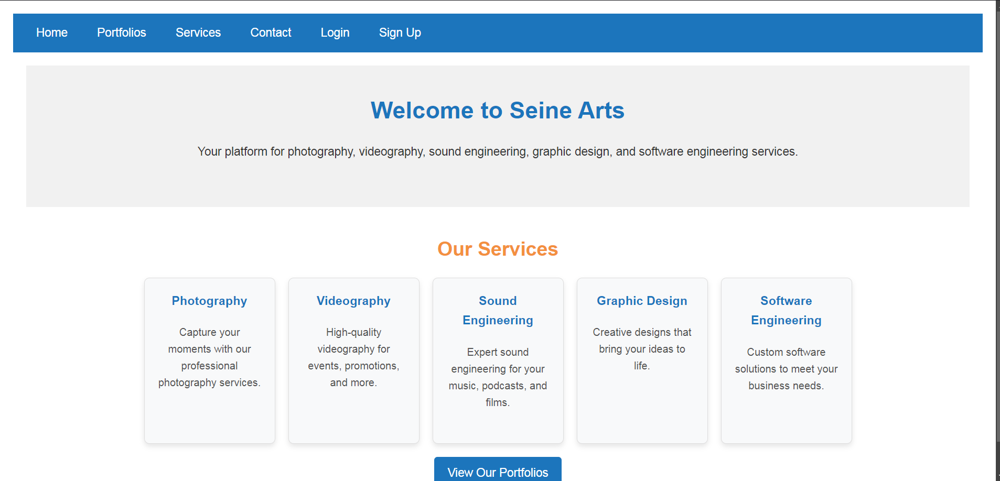
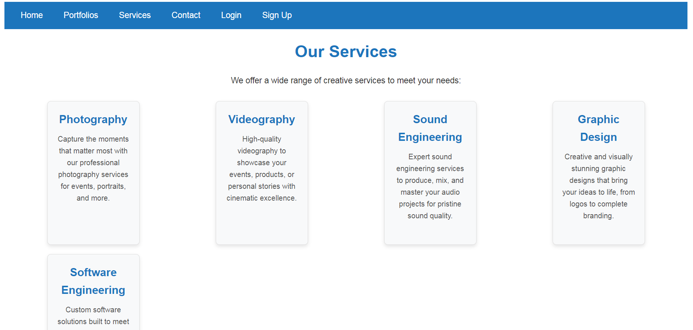

Here’s a **detailed README** for your **Seine Arts** project. It will help users, contributors, and developers understand how to set up, run, and contribute to the project.

---

# **Seine Arts**

Seine Arts is a platform where professionals offering services in **photography**, **videography**, **sound engineering**, **graphic design**, and **software engineering** can showcase their portfolios, connect with clients, and receive payments for their work. The platform allows admins to assign projects to professionals, while also handling payments.

## **Table of Contents**
- [Overview](#overview)
- [Features](#features)
- [Tech Stack](#tech-stack)
- [Project Setup](#project-setup)
  - [Backend Setup](#backend-setup)
  - [Frontend Setup](#frontend-setup)
- [Environment Variables](#environment-variables)
- [Running the Application](#running-the-application)
- [Deployment](#deployment)
- [API Documentation](#api-documentation)
- [Screenshots](#screenshots)
- [Contributing](#contributing)
- [License](#license)

---

## **Overview**

Seine Arts is a platform that connects clients with professionals in creative fields, specifically:
- Photography
- Videography
- Sound Engineering
- Graphic Design
- Software Engineering

Admins manage project assignments, and the platform also provides a way to handle payments via **PayPal**. 

## **Features**
- **User Authentication**: Secure signup and login using JWT.
- **Portfolio Management**: Professionals can upload portfolios to showcase their work.
- **Project Management**: Admins can assign projects to professionals based on their portfolios.
- **Payment Handling**: Payments are processed via PayPal integration.
- **Responsive Design**: The frontend is fully responsive across devices.
- **Role-Based Access**: Different functionality for clients, professionals, and admins.

---

## **Tech Stack**

### **Backend**:
- **Node.js**
- **Express.js**
- **MongoDB** (via **Mongoose**)
- **JWT** for authentication
- **PayPal SDK** for payment processing
- **CORS** for cross-origin requests

### **Frontend**:
- **React.js** (via Create React App)
- **Axios** for API calls
- **React Router** for navigation
- **CSS** for styling

### **Deployment**:
- **Backend**: [Render](https://render.com)
- **Frontend**: [Vercel](https://vercel.com)
- **Database**: [MongoDB Atlas](https://www.mongodb.com/cloud/atlas)

---

## **Project Setup**

### **Backend Setup**

1. **Clone the Repository**:
   ```bash
   git clone https://github.com/your-username/seine-arts-backend.git
   cd seine-arts-backend
   ```

2. **Install Dependencies**:
   ```bash
   npm install
   ```

3. **Create `.env` File**:
   Create a `.env` file in the root directory with the following variables:
   ```plaintext
   MONGO_URI=your-mongodb-connection-string
   JWT_SECRET=your-jwt-secret
   PAYPAL_CLIENT_ID=your-paypal-client-id
   PAYPAL_SECRET=your-paypal-secret
   ```

4. **Start the Server**:
   Run the server locally:
   ```bash
   npm start
   ```
   The backend will run on `http://localhost:5000`.

---

### **Frontend Setup**

1. **Clone the Repository**:
   ```bash
   git clone https://github.com/your-username/seine-arts-frontend.git
   cd seine-arts-frontend
   ```

2. **Install Dependencies**:
   ```bash
   npm install
   ```

3. **Create `.env` File**:
   Create a `.env` file in the root directory with the following variable:
   ```plaintext
   REACT_APP_API_URL=http://localhost:5000
   ```
   Replace `http://localhost:5000` with the live backend URL if the backend is deployed.

4. **Start the Frontend**:
   Run the frontend locally:
   ```bash
   npm start
   ```
   The frontend will run on `http://localhost:3000`.

---

## **Environment Variables**

### Backend `.env` File:
```plaintext
MONGO_URI=your-mongodb-connection-string
JWT_SECRET=your-jwt-secret
PAYPAL_CLIENT_ID=your-paypal-client-id
PAYPAL_SECRET=your-paypal-secret
```

### Frontend `.env` File:
```plaintext
REACT_APP_API_URL=http://localhost:5000
```

Make sure to configure these on the deployment platforms (Render for backend, Vercel for frontend).

---

## **Running the Application**

To run the full-stack application locally, follow these steps:

1. **Start Backend**:
   Run this in the backend directory:
   ```bash
   npm start
   ```

2. **Start Frontend**:
   Run this in the frontend directory:
   ```bash
   npm start
   ```

Once both are running:
- Frontend: `http://localhost:3000`
- Backend: `http://localhost:5000`

The frontend will communicate with the backend via the API endpoints defined in `REACT_APP_API_URL`.

---

## **Deployment**

### Backend Deployment (Render):
1. Push your backend code to a GitHub repository.
2. On Render, create a new Web Service and connect it to your GitHub repo.
3. Set up environment variables on Render (`MONGO_URI`, `JWT_SECRET`, `PAYPAL_CLIENT_ID`, `PAYPAL_SECRET`).
4. Deploy the service and grab the live backend URL.

### Frontend Deployment (Vercel):
1. Push your frontend code to a GitHub repository.
2. On Vercel, create a new project and connect it to your GitHub repo.
3. Set the environment variable `REACT_APP_API_URL` to the live backend URL from Render.
4. Deploy the frontend.

---

## **API Documentation**

Here is a brief overview of the available backend API routes.

### **Auth Routes**:
- **POST** `/api/auth/signup`: Register a new user.
- **POST** `/api/auth/login`: Log in an existing user.

### **Portfolio Routes**:
- **GET** `/api/portfolios`: Fetch all portfolios.
- **POST** `/api/portfolios`: Add a new portfolio (protected route).

### **Payment Routes**:
- **POST** `/api/payments/create`: Create a new PayPal payment (protected route).

More routes can be added as the project grows.

---

## **Screenshots**
, 

---

## **Contributing**

Contributions are welcome! Please follow these steps:

1. **Fork the repository**.
2. **Create a new feature branch** (`git checkout -b feature-branch`).
3. **Commit your changes** (`git commit -m 'Add some feature'`).
4. **Push to the branch** (`git push origin feature-branch`).
5. **Create a pull request**.

---

## **License**

This project is licensed under the MIT License - see the [LICENSE](LICENSE) file for details.

---

This README provides a comprehensive guide for setting up, running, and deploying the **Seine Arts** project. Let me know if you need any further adjustments!